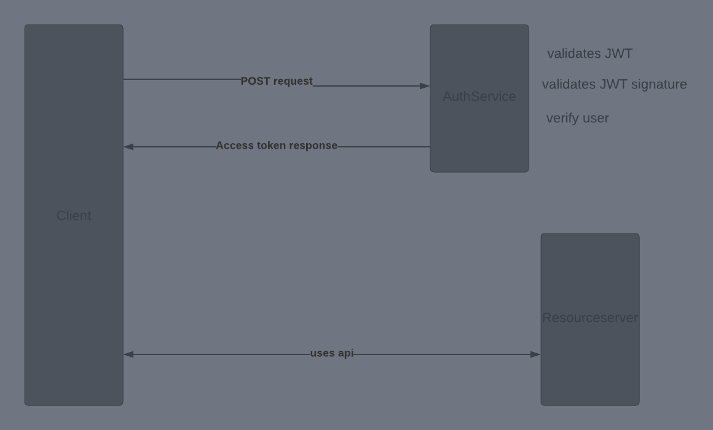

# Auth-service

## Reasoning

Felt like I needed to try creating an auth service as it is something that I wanted to get a better grasp of.
Reason to why I choose typescript, express and prisma is because of ease of use as these are tools that I have used more and feel more secure in compared to using golang.

## Theory
JWT (JSON Web Token) is an open standard that makes possible to transmiitt information between parties as JSON object.

## request flow

